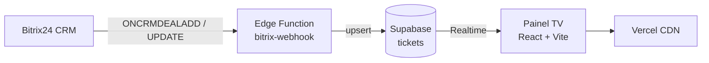

# Dashboard de Suportes Presenciais

Painel em tempo real para exibição em TV no salão — fila de atendimento presencial integrada ao **Bitrix24**, com dados sincronizados via **Supabase Realtime**.

**Produção:** [dashsuportespresenciais.vercel.app](https://dashsuportespresenciais.vercel.app)  
**Repositório:** [github.com/RafaelADSdev/Dashboard-de-Suportes-Presenciais-](https://github.com/RafaelADSdev/Dashboard-de-Suportes-Presenciais-)

---

## Visão geral

O sistema recebe eventos de deals do Bitrix24 (criação e atualização de estágio), normaliza os dados em uma tabela `tickets` no Supabase e exibe o painel com atualização instantânea — sem refresh manual.

Suporta filtro por superintendência (**Stüpp** / **Nascimento**) e priorização **FIFO** por data de criação.



---

## Funcionalidades

| Área | Descrição |
|------|-----------|
| **Suporte em andamento** | Ticket ativo centralizado, com departamento e ferramenta |
| **Último resolvido** | Foto e departamento do solicitante do último atendimento concluído |
| **Próximos suportes** | Fila ordenada por posição, solicitante, departamento, data/hora e ferramenta |
| **Resumo por status** | Contadores por estágio (aguardando, em atendimento, etc.) |
| **Carrossel de informações** | Slides editáveis no próprio painel (texto ou imagem) |
| **Filtro de superintendência** | Alternância Stüpp / Nascimento no header |
| **Vídeo de fundo** | Background Hub On com opacidade reduzida |

---

## Stack

| Camada | Tecnologia |
|--------|------------|
| Frontend | React 18, TypeScript, Vite |
| UI | Tailwind CSS, shadcn/ui, Lucide |
| Backend / dados | Supabase (Postgres + Realtime) |
| Integração CRM | Bitrix24 via Edge Function (Deno) |
| Deploy frontend | Vercel |
| Deploy backend | Supabase Edge Functions |

---

## Estrutura do projeto

```
├── src/
│   ├── components/
│   │   └── PainelPrincipal.tsx   # UI principal do painel TV
│   ├── integrations/supabase/    # Cliente e tipos Supabase
│   ├── lib/
│   │   ├── tickets-db.ts         # Leitura e mapeamento de tickets
│   │   ├── priority-engine.ts    # Fila FIFO e posição
│   │   └── mock-data.ts          # Tipos TypeScript (Ticket, Status…)
│   ├── pages/Index.tsx
│   └── assets/                   # Logos, vídeo de fundo
├── supabase/
│   ├── functions/bitrix-webhook/ # Webhook Bitrix → Supabase
│   └── migrations/               # Alterações de schema
├── vercel.json                   # Rewrite SPA
└── .env.example                  # Variáveis do frontend
```

---

## Pré-requisitos

- [Node.js](https://nodejs.org/) 18+ e npm
- Conta [Supabase](https://supabase.com/) com projeto configurado
- [Supabase CLI](https://supabase.com/docs/guides/cli) (para deploy da Edge Function)
- Portal Bitrix24 com permissão para configurar webhooks de saída
- Conta [Vercel](https://vercel.com/) (deploy do frontend)

---

## Configuração local

### 1. Clonar e instalar

```bash
git clone https://github.com/RafaelADSdev/Dashboard-de-Suportes-Presenciais-.git
cd Dashboard-de-Suportes-Presenciais-
npm install
```

### 2. Variáveis de ambiente (frontend)

Copie o exemplo e preencha com os dados do seu projeto Supabase:

```bash
cp .env.example .env
```

| Variável | Descrição |
|----------|-----------|
| `VITE_SUPABASE_URL` | URL do projeto (`https://<ref>.supabase.co`) |
| `VITE_SUPABASE_PUBLISHABLE_KEY` | Chave publishable (Settings → API) |
| `VITE_SUPABASE_PROJECT_ID` | ID do projeto (referência) |

### 3. Subir o frontend

```bash
npm run dev
```

Acesse `http://localhost:5173`.

---

## Supabase

### Tabela `tickets`

Campos principais usados pelo painel:

| Coluna | Origem / uso |
|--------|----------------|
| `ticket_id` | ID do deal no Bitrix |
| `solicitante` | Campo **Nome do solicitante do Suporte** (`UF_CRM_1749565390`); departamento via usuário vinculado ou busca na estrutura da empresa |
| `solicitante_foto` | Foto do perfil Bitrix (usuário vinculado ou encontrado pelo nome) |
| `responsavel` | `ASSIGNED_BY_ID` |
| `departamento` | Departamento do solicitante (`department.get`) |
| `ferramenta` | Campo mapeado no webhook |
| `status` | Estágio do funil (normalizado) |
| `superintendencia` | Stüpp ou Nascimento |
| `criado_em` / `resolvido_em` | Timestamps para fila e histórico |

Aplique migrations quando necessário:

```bash
supabase db push
```

### Edge Function `bitrix-webhook`

**URL de produção:**

```
https://<PROJECT_REF>.supabase.co/functions/v1/bitrix-webhook
```

Deploy:

```bash
supabase functions deploy bitrix-webhook --no-verify-jwt
```

> A função usa `verify_jwt: false` porque o Bitrix envia `application/x-www-form-urlencoded`, não JWT do Supabase.

#### Secrets (Supabase Dashboard → Edge Functions → Secrets)

| Secret | Obrigatório | Descrição |
|--------|-------------|-----------|
| `BITRIX_INCOMING_WEBHOOK` | Sim | Webhook de entrada Bitrix (crm, user, department) |
| `BITRIX_APP_TOKEN` | Sim | Token do app Bitrix para validar requisições |
| `SUPABASE_URL` | Sim | Injetado automaticamente no deploy |
| `SUPABASE_SERVICE_ROLE_KEY` | Sim | Injetado automaticamente no deploy |
| `BITRIX_PEDRO_LEAL_USER_ID` | Não | ID do responsável alvo (ex.: `1326`) |
| `BITRIX_FILTRAR_PEDRO_LEAL` | Não | `true` filtra só deals do responsável Pedro Leal (padrão: desligado) |
| `BITRIX_RESPONSAVEL_NOME` | Não | Nome do responsável (padrão: Pedro Leal) |
| `BITRIX_CATEGORY_ID` | Não | ID do funil CRM (padrão: `54`) |
| `BITRIX_SUP_NASCIMENTO_DEPT_ID` | Não | Dept. superintendência Nascimento (padrão: `7`) |
| `BITRIX_SUP_STUBPP_DEPT_ID` | Não | Dept. superintendência Stüpp (padrão: `3`) |
| `BITRIX_PAINEL_MARKERS` | Não | Textos aceitos no campo Observação (padrão: `SUPORTE PRESENCIAL NO SALÃO`) |
| `BITRIX_OBSERVACAO_FIELD` | Não | Código UF do campo Observação (auto-detecta se vazio) |
| `BITRIX_SYNC_SECRET` | Não | Segredo para `?action=sync` (sincronização em lote) |
| `BITRIX_NOME_SOLICITANTE_FIELD` | Não | Campo CRM do nome do solicitante (padrão: `UF_CRM_1749565390`) |

---

## Configuração no Bitrix24

1. Acesse **Aplicativos → Webhooks → Webhook de saída** (ou handler de app local).
2. Registre os eventos:
   - `ONCRMDEALADD`
   - `ONCRMDEALUPDATE`
3. Aponte a URL para a Edge Function do Supabase.
4. Garanta que o webhook de **entrada** usado em `BITRIX_INCOMING_WEBHOOK` tenha escopo para:
   - `crm.deal.get`
   - `crm.deal.list`
   - `crm.deal.userfield.list`
   - `user.get` (inclui busca por `FILTER[NAME_SEARCH]` na estrutura da empresa)
   - `department.get`

### Mapeamentos Bitrix relevantes

| Campo Bitrix | Uso |
|--------------|-----|
| Campo **Observação** | Deve conter `SUPORTE PRESENCIAL NO SALÃO` para entrar no painel |
| `UF_CRM_1749565390` | Nome do solicitante do Suporte (texto exibido no painel) |
| `UF_CRM_1749565388` | Solicitante — usuário (vínculo para foto e departamento) |
| `ASSIGNED_BY_ID` | Responsável |
| `UF_DEPARTMENT` | Departamento do perfil do solicitante (estrutura da empresa) |
| Dept. ID `7` | Superintendência Nascimento |
| Dept. ID `3` | Superintendência Stüpp |

Estágios do funil são convertidos para status internos (`em_atendimento`, `nova_solicitacao`, `concluido`, etc.) pela Edge Function.

Deals no funil de suporte entram no painel quando o campo **Observação** contém **SUPORTE PRESENCIAL NO SALÃO**. A sincronização em lote (`?action=sync`) varre a esteira a cada abertura do painel (com `VITE_BITRIX_SYNC_SECRET`) e a cada 3 minutos.

---

## Deploy

### Frontend (Vercel)

O projeto está configurado como SPA Vite. Deploy automático a cada push em `main`.

1. Importe o repositório na [Vercel](https://vercel.com/new).
2. Configure as três variáveis `VITE_*` em **Settings → Environment Variables** (Production e Preview).
3. Build: `npm run build` · Output: `dist`

Deploy manual via CLI:

```bash
npx vercel deploy --prod
```

### Backend (Supabase)

A Edge Function e o banco **não** são deployados pela Vercel. Use sempre o Supabase CLI ou o dashboard para functions e migrations.

---

## Scripts disponíveis

| Comando | Descrição |
|---------|-----------|
| `npm run dev` | Servidor de desenvolvimento |
| `npm run build` | Build de produção |
| `npm run preview` | Preview do build local |
| `npm run lint` | ESLint |
| `npm test` | Testes (Vitest) |

---

## Fluxo de status

```
nova_solicitacao / aguardando / aguardando_solicitante / validar_ajuste
        ↓
   em_atendimento
        ↓
   concluido / finalizado
```

Tickets em status de fila entram na lista **Próximos suportes**, ordenados por `criado_em` (FIFO).

---

## Solução de problemas

| Sintoma | Verificação |
|---------|-------------|
| Painel vazio | Confirme `VITE_*` no `.env` ou na Vercel e refaça o build |
| Dados não atualizam | Realtime habilitado na tabela `tickets` no Supabase |
| Webhook não grava | Logs em Supabase → Edge Functions → `bitrix-webhook` |
| Deals ignorados | Filtro `BITRIX_FILTRAR_PEDRO_LEAL` e `BITRIX_CATEGORY_ID` |
| Erro de API Bitrix | Secret `BITRIX_INCOMING_WEBHOOK` com escopos corretos |

---

## Licença

Projeto privado — Hub Nogueira / uso interno.
